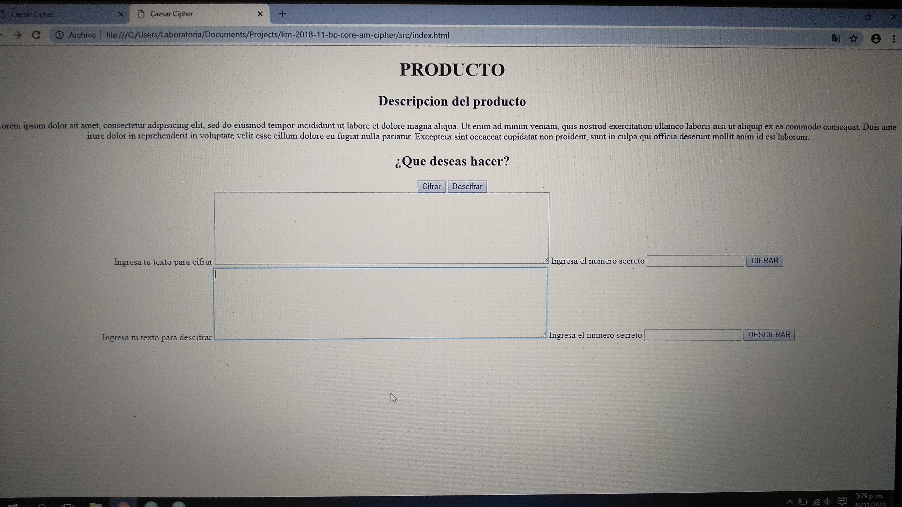
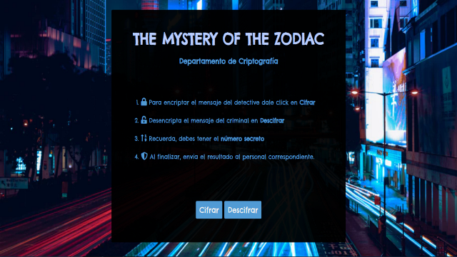

# Cifrado César

Cifrar significa codificar. El [cifrado César](https://en.wikipedia.org/wiki/Caesar_cipher) es uno de los primeros métodos de cifrado conocidos. El emperador romano Julio César lo usaba para enviar órdenes secretas a sus generales en los campos de batalla.

El cifrado césar es una de las técnicas más simples para cifrar un mensaje. Es un tipo de cifrado por sustitución, es decir que cada letra del texto original es reemplazada por otra que se encuentra un número fijo de posiciones (desplazamiento) más adelante en el mismo alfabeto.

Por ejemplo, si usamos un desplazamiento (_offset_) de 3 posiciones:

- La letra A se cifra como D.
- La palabra CASA se cifra como FDVD.
- Alfabeto sin cifrar: A B C D E F G H I J K L M N O P Q R S T U V W X Y Z
- Alfabeto cifrado: D E F G H I J K L M N O P Q R S T U V W X Y Z A B C

En la actualidad, todos los cifrados de sustitución simple se descifran con mucha facilidad y, aunque en la práctica no ofrecen mucha seguridad en la comunicación por sí mismos; el cifrado César sí puede formar parte de sistemas más complejos de codificación, como el cifrado Vigenère, e incluso tiene aplicación en el sistema ROT13.

## Definición del Producto

- Quiénes son los principales usuarios de producto?

The Mystery of the Zodiac va dirigido a los integrantes y/o personal de un Departamento de Investigaciones y criptografia, el cual pertenece a una Comandancia de Policia y Detectives.

- Cuáles son los objetivos de estos usuarios en relación con tu producto?

Primero que nada debo colocarles en contexto. En el año 1968, en San Francisco, apareció un asesino en serie que se hizo famoso mundialmente como El Zodiaco, el enviaba mensajes encriptados a su manera para que asi supieran donde lo iban a atrapar y contra quien iba a atentar. Hasta el sol de hoy, no se ha atrapado porque no han podido descifrar sus mensajes.
En vista de esto, muchos asesinos alrededor del mundo han querido copiar la manera en que el Zodiaco escribia sus mensajes, de manera encriptada.

Este departamento necesita desencriptar y/o encriptar ciertos mensajes que algunos asesinos en serie y/o criminales envian, a traves de medios de comunicacion de la region o por distintos canales de comunicacion, o ya sea por alguna investigacion exhaustiva de algun detective. El objetivo es saber que dice dicho mensaje cifrado, y no solo saberlo, sino determinarlo lo mas pronto posible o en corto tiempo para poder atrapar al enemigo en cuestion. En muchos casos, el enemigo se ha salido con la suya porque han demorado mucho en descifrar el mensaje (manualmente) y ya cuando lo han descifrado es demasiado tarde y se ha cobrado una victima mas.

- ¿Cómo crees que el producto que estás creando está resolviendo sus problemas?

 The Mystery of the Zodiac propone cifrar y descifrar esos mensajes en tiempo record, para que asi el equipo de investigadores faciliten esta informacion a los detectives lo mas pronto posible para que atrapen al enemigo oportunamente.

### Proceso a nivel de experiencia y diseño

En primer lugar, se realizó el flujograma. De alli, se partio para hacer el prototipado el cual consto de varias revisiones y feedback con otras compañeras sobre usabilidad, experiencia de usuario, hasta que se llegó al prototipo final (tomando en cuenta sus consejos) que, si bien el producto final no es identico, se le parece bastante.

![Flujograma][1]  ![Prototipado][2]

[1]: src/pictures/Flujograma.jpg
[2]: src/pictures/Prototipado.jpg

El proyecto en total, se dividio en dos Sprint, cada uno con una duracion de una semana. En el primero, me enfoque en hacer tareas pequeñas como por ejemplo las funciones de cifrar y descifrar una letra, luego una palabra y luego un texto completo; darle una interfaz sencilla donde el usuario pudiera ingresar los datos sin mucho diseño, el DOM, estructura html, en si me concentre mas que todo en la funcionalidad de mi pagina, para que cuando clickeara en algun boton, este hiciera lo que le habia mandado a hacer, por medio del DOM. Luego, en el segundo sprint, me concentre en hacer testing unitario, en dedicarme mas al diseño CSS, responsive design (el cual se me complico bastante), el readme, los requirimientos obligatorios para luego, si daba tiempo, enfocarme en la version hacker edition. Se utilizo la herramienta de papel bond y tablero canvas, dividiendolo por tareas generales, luego en tareas pequeñas y actualizando el tablero cada vez que terminaba alguna tarea, y si es que me bloqueaba en alguna tarea los coaches venian al rescate para apoyarme y aclarar mis dudas, lo cual agradezco muchisimo.

Las decisiones de diseño, fueron varias a lo largo del proyecto. Primero, como no se mucho de diseño ni de colores (no es mi fuerte), decidi basarme en la paleta de colores que usa la pelicula que me inspiro a escoger el tema de mi proyecto (basada en hechos reales "El Zodiaco"). Esta paleta de colores venia dada por colores madera y beigh.

![Segunda Interfaz][5]  ![Fondo poco aceptado][6]

[5]: src/pictures/Segunda_vista.png
[6]: src/pictures/Cambio_fondo.png

Sin embargo, tomando en cuenta las muy valiosas opiniones y feedbacks de mis compañeras de squad y fuera de el, decidi seguir sus consejos y basarme en una paleta de colores que va del azul oscuro al azul claro con algunos matices de negro para lo que es la tematica, que es la investigacion. Luego, coloque un fondo caracteristico del tema, con una ciudad de noche y muchas letras, el cual fue cambiado tambien luego de un testeo con un coach (en este caso Daniela) y varios amigos, me sugirieron cambiarlo porque las letras del fondo mareaban un poco. Decidí cambiarlo por otro menos cargado.

En cuanto al contenido, en un principio habia colocado un texto muy largo contando la historia del zodiaco y las necesidades que habia que cubrir en el departamento de investigaciones, sin embargo, una vez mas llegaron al rescate mis compañeras y me hicieron saber que era un texto muy largo y aburrido a la vista y que al usuario le iba a cansar leer todo ese testamento. Por ello, decidi resumirlo todo dando pequeñas instrucciones claves de como funcionaba mi aplicacion y como podian cifrar o descifrar, nada mas para que la experiencia de usuario fuese mas didactica y menos tediosa. La ultima pantalla muestra un mensaje conteniendo el texto ya procesado y un mensaje caracteristico del tema en cuestion que coloque (Apresurate, no hay tiempo que perder), tambien luego de un testeo.

![Cifrar][3]  ![Cifrado][4]

[3]: src/pictures/Cifrar.png
[4]: src/pictures/Cifrado.png
